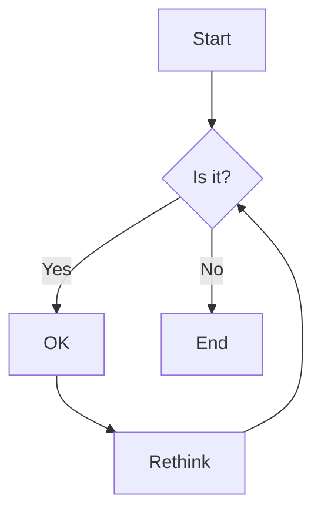

# Markdown Cheatsheet

## Headers
```markdown
# H1
## H2
### H3
#### H4
##### H5
###### H6
```

## Text Formatting
- **Bold**: `**bold text**` or `__bold text__`
- *Italic*: `*italic text*` or `_italic text_`
- ~~Strikethrough~~: `~~strikethrough text~~`
- **Bold and _nested italic_**: `**Bold and _nested italic_**`
- `inline code`: `` `inline code` ``

## Lists

### Unordered List
```markdown
- Item 1
- Item 2
  - Nested Item 1
  - Nested Item 2
```

### Ordered List
```markdown
1. First item
2. Second item
   1. Nested item
   2. Another nested item
3. Third item
```

### Task List
```markdown
- [x] Completed task
- [ ] Incomplete task
```

## Links and Images
- [Link](https://example.com)
- 

## Code Blocks

### Inline Code
```
`console.log('Hello, World!');`
```

### Code Block with Syntax Highlighting
```javascript
function hello() {
  console.log('Hello, World!');
  return true;
}
```

## Tables
```markdown
| Syntax      | Description |
| ----------- | ----------- |
| Header      | Title       |
| Paragraph   | Text        |
```

## Blockquotes
```markdown
> This is a blockquote.
> It can span multiple lines.
```

## Horizontal Rule
```markdown
---
```

## HTML
You can use HTML tags in markdown for more control:

```html
<button>Click me</button>
```

## Escaping Characters
Use \ before special characters to display them literally:

```markdown
\* This is not italic \*
```

## Line Breaks
End a line with two or more spaces to create a line break.  
Like this!

## Footnotes
Here's a simple footnote[^1].

[^1]: This is the footnote content.

## Emoji
:smile: :rocket: :thumbsup:

## Mermaid Diagrams (GitHub Flavored Markdown)


## Math Equations (GitHub Flavored Markdown)
```math
\int_0^\infty x^2 dx
```

## Tips
- Use blank lines to separate paragraphs
- Indent code blocks with 4 spaces or triple backticks
- Most markdown processors support HTML for more complex formatting
- Different platforms (GitHub, GitLab, etc.) may have additional features
